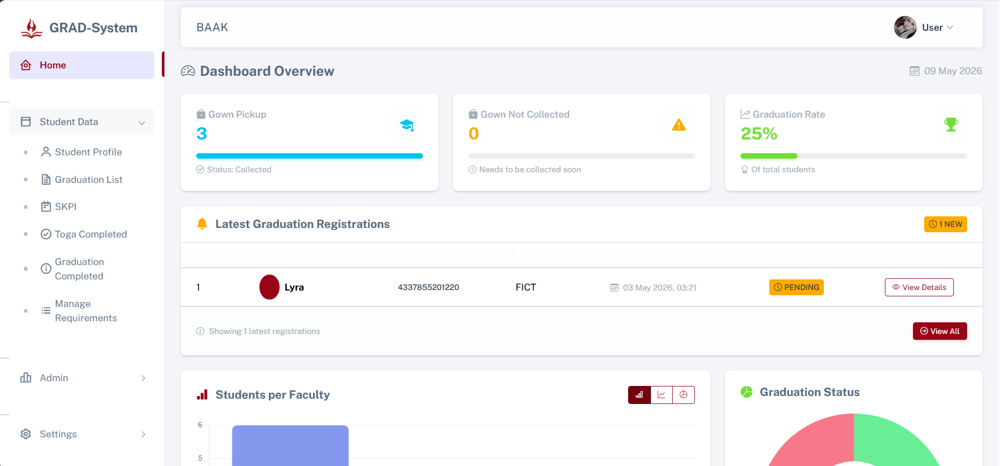
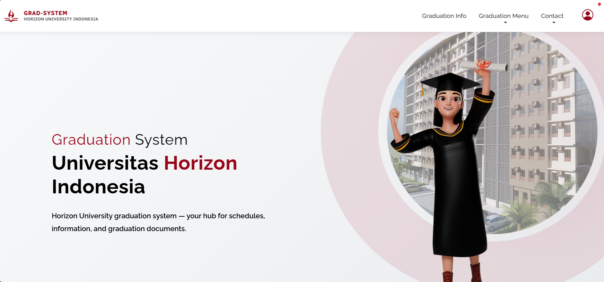

# GRAD-System

Graduation administration management system built using Laravel to streamline the graduation process between students, BAAK, and related departments.

## Overview

GRAD-System is a web-based graduation management platform designed to help universities manage student graduation requirements more efficiently.

The system provides separate dashboards and access control for multiple user roles, including:

* BAAK (Academic Administration)
* Students
* Library Staff
* Finance Staff
* CSDL Staff
* Faculty Staff

Each role has its own responsibilities and permissions within the system to ensure a structured and secure graduation verification workflow.

---

# Main Features

## Multi-Role Authentication & Authorization

* Separate dashboards for each role
* Role-based access control
* Secure login system
* Student accounts generated automatically by BAAK

## Student Data Management

BAAK can:

* Import student data
* Export student data
* Edit student information
* Delete student records

When student data is imported, the system automatically generates login credentials and sends usernames/passwords directly to each student's email.

## Graduation Registration Management

Students can register for graduation directly through the system.

BAAK can monitor:

* Graduation registration status
* Requirement completion
* Approval progress from related departments
* Notes and revision comments from staff

Related departments (Library, Finance, CSDL, and Faculty) can:

* Approve requirements
* Add notes for incomplete submissions
* View only their own validation section

Only BAAK has full visibility of all approval statuses.

## Notification System

Students receive notifications regarding:

* Graduation announcements
* Approval updates
* Incomplete requirements
* Staff revision notes

## SKPI Management

Students can submit SKPI data and documents directly through the system.

BAAK can:

* Review documents
* Edit records
* Print documents
* Delete data

## Toga Distribution Tracking

The system tracks students who:

* Have completed graduation requirements
* Have submitted SKPI
* Have collected graduation gowns (toga)

## Information & Announcement Management

BAAK can:

* Publish graduation announcements
* Upload graduation images
* Share important information with students

## Q&A Management

A built-in Q&A feature allows BAAK to answer frequently asked questions to reduce repetitive inquiries from students.

## Testimonial Moderation

Students can submit feedback regarding their graduation experience.

Testimonials are reviewed by BAAK before being published.

## Student Dashboard

Students can:

* View graduation information
* Register for graduation
* Submit SKPI
* Read requirements and announcements
* Receive notifications
* Update profile information
* Submit testimonials
* Contact BAAK via WhatsApp or Email

---

# Technologies Used

* Laravel
* PHP
* MySQL
* Blade Template
* Bootstrap
* JavaScript
* HTML & CSS

---

# System Roles

| Role          | Responsibilities                                  |
| ------------- | ------------------------------------------------- |
| BAAK          | Full graduation management and monitoring         |
| Student       | Registration, SKPI submission, profile management |
| Library Staff | Library requirement approval                      |
| Finance Staff | Financial requirement approval                    |
| CSDL Staff    | CSDL requirement approval                         |
| Faculty Staff | Faculty requirement approval                      |

---

# Key Highlights

* Multi-role dashboard system
* Centralized graduation verification workflow
* Automated email credential delivery
* Real-time requirement tracking
* Notification and approval management
* Document management system
* Responsive web interface

---

# Screenshots

## Login Page

## Admin Dashboard

## Student Dashboard

---

# Developer

Developed by Liana Syifa Fauzia.
